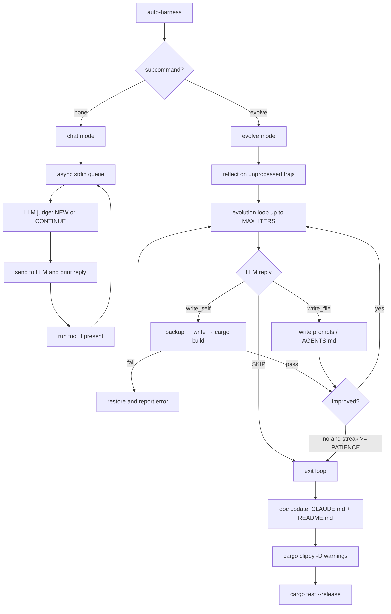

# AutoHarness

<p align="center">
  <strong>A self-evolving coding agent in Rust.</strong><br/>
  Chat with it, let it reflect, and let it improve itself.
</p>

<p align="center">
  
  
  
</p>

<p align="center">
  
</p>

---

## ✨ What is AutoHarness?

AutoHarness is a compact Rust agent with two modes:

- **Interactive chat mode** for normal task execution
- **Evolution mode** where it reflects on trajectories and rewrites parts of itself

It logs everything, verifies self-edits with `cargo build --release`, and uses the LLM as the judge (no numeric reward model).

---

## 🚀 Quick Start

```bash
# Build
cargo build --release

# Run chat mode
./target/release/auto-harness

# Run evolution mode
./target/release/auto-harness evolve
```

Use any OpenAI-compatible backend:

```bash
export OPENROUTER_API_KEY=anything
export INFERENCE_BASE_URL=http://localhost:11434/v1
export MODEL_NAME=llama3
```

---

## 🧠 How It Works



---

## 🔧 Modes

### Chat Mode (default)
- REPL with async stdin queue (`VecDeque`)
- LLM decides if each message starts a **new task** or **continues** the current one
- Artifacts are separated into `outputs/<ts>/task_N`
- Events are logged to `.evo/sessions/<ts>/traj.jsonl`

### Evolve Mode (`auto-harness evolve`)
1. **Reflect:** analyze unprocessed trajectories and produce one concrete improvement
2. **Evolve:** iterate up to `MAX_ITERS`, applying one LLM-proposed change per iteration
3. **Doc update:** rewrite `CLAUDE.md` and `README.md`
4. **Validate:** run `cargo clippy -- -D warnings` and `cargo test --release`

---

## 🧩 Evolvable Artifacts

| Artifact | How it evolves |
|---|---|
| `src/main.rs` | `write_self` (atomic rewrite + build verification) |
| `src/AGENTS.md` | `write_file` |
| `src/prompts/chat_system.txt` | `write_file` |
| `src/prompts/reflect_system.txt` | `write_file` |
| `src/prompts/evolve_system.txt` | `write_file` |
| `src/prompts/doc_system.txt` | `write_file` |
| `CLAUDE.md` | `write_file` (doc update step) |
| `README.md` | `write_file` (doc update step) |

---

## 🗂️ Project Layout

```text
.
├── Cargo.toml
├── README.md
├── CLAUDE.md
├── src/
│   ├── main.rs
│   ├── AGENTS.md
│   └── prompts/
│       ├── chat_system.txt
│       ├── reflect_system.txt
│       ├── evolve_system.txt
│       └── doc_system.txt
├── .evo/
│   ├── sessions/<ts>/traj.jsonl
│   └── learned_until.txt
└── outputs/<ts>/task_N
```

---

## ⚙️ Configuration

| Variable | Default | Description |
|---|---|---|
| `OPENROUTER_API_KEY` | required | API key |
| `INFERENCE_BASE_URL` | `https://openrouter.ai/api/v1` | OpenAI-compatible API endpoint |
| `MODEL_NAME` | `anthropic/claude-opus-4` | Model identifier |

Core constants in `src/main.rs`:
- `MAX_ITERS = 10`
- `PATIENCE = 3`

---

## 📚 Citation

```bibtex
@software{autoharness2026,
  title  = {AutoHarness: A Self-Evolving Coding Agent in Rust},
  author = {Zhao, Zhimin},
  year   = {2026},
  url    = {https://github.com/Engineering4AI/AutoHarness}
}
```
