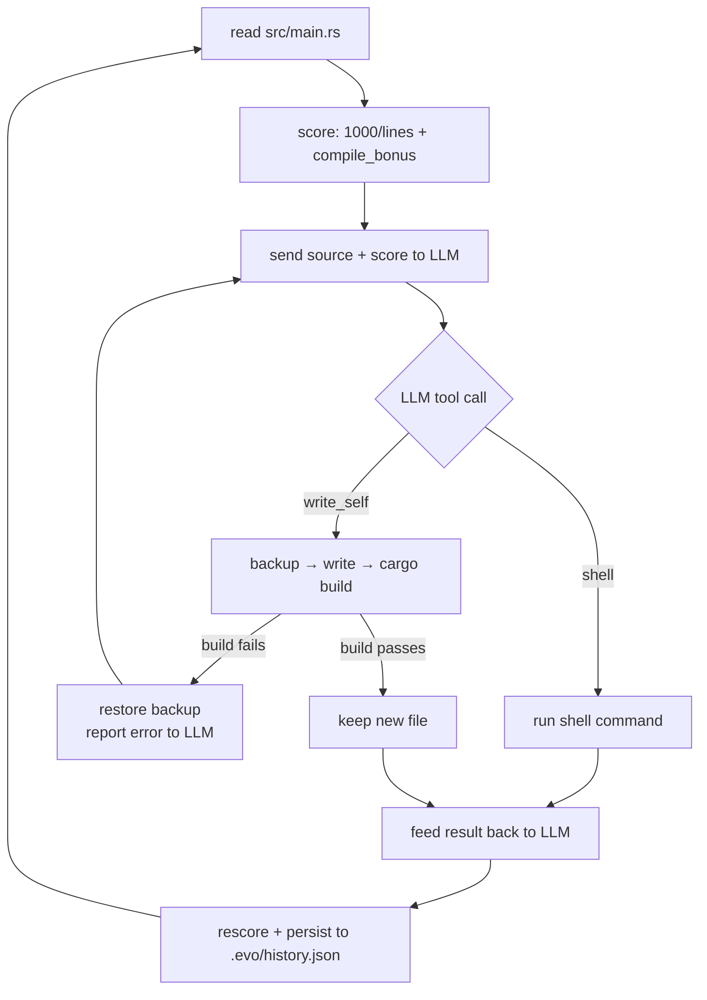

# AutoHarness

A self-evolving coding agent in Rust — the smallest possible implementation that actually works.


The agent reads its own source code, asks an LLM to improve it, executes the proposed changes, scores the result, and repeats. Over time it tries to make itself shorter, more correct, and more capable.

## How it works



### Scoring

```
score = 1000 / line_count          (fewer lines = higher score)
      + 1.0   if cargo build passes (compile bonus)
```

The LLM is incentivised to compress the source while keeping it compiling.

### Tool dispatch

The LLM emits plain-text XML-like tags — no framework, no function-calling schema:

```
<tool name="shell">cargo test 2>&1</tool>
<tool name="write_self">...full new src/main.rs...</tool>
```

The agent parses these with string search and feeds the result back as the next user message.

`write_self` is atomic: the agent backs up the current file, writes the new code, runs `cargo build --release`, and automatically restores the backup if the build fails — reporting the compiler error back to the LLM so it can self-correct.

### History

Each iteration's score is saved to `.evo/history.json`. On restart the agent resumes where it left off (iteration counter continues from the last saved entry).

## Quick start

### 1. Install Rust

```bash
curl --proto '=https' --tlsv1.2 -sSf https://sh.rustup.rs | sh
source ~/.cargo/env
```

### 2. Configure API key

Create a `.env` file in the project root (loaded automatically on startup — no `export` needed):

```env
# OpenRouter (recommended — supports many models)
OPENROUTER_API_KEY=sk-or-...

# Optional overrides
INFERENCE_BASE_URL=https://openrouter.ai/api/v1   # default
MODEL_NAME=anthropic/claude-opus-4                 # default
```

Or export directly:

```bash
export OPENROUTER_API_KEY=sk-or-...
```

Or any OpenAI-compatible endpoint (Ollama, vLLM, Together, etc.):

```bash
export OPENROUTER_API_KEY=anything
export INFERENCE_BASE_URL=http://localhost:11434/v1
export MODEL_NAME=llama3
```

### 3. Build and run

```bash
cargo build --release
./target/release/auto-harness          # run the agent loop (10 iterations)
./target/release/auto-harness eval     # print current score and exit
```

## File layout

```
.
├── Cargo.toml              # ureq + serde + serde_json
├── src/
│   ├── main.rs             # the entire agent (~270 lines)
│   └── main.rs.bak         # last known-good version (auto-created)
├── .env                    # API keys (not committed)
└── .evo/
    └── history.json        # iteration scores (auto-created)
```

## Configuration

| Variable | Default | Description |
|---|---|---|
| `OPENROUTER_API_KEY` | — | OpenRouter key (required) |
| `INFERENCE_BASE_URL` | `https://openrouter.ai/api/v1` | Any OpenAI-compat base URL |
| `MODEL_NAME` | `anthropic/claude-opus-4` | Model identifier |

`MAX_ITERS` (default `10`) and `PATIENCE` (default `3`) are compile-time constants in `src/main.rs`.

## What happens on each run

```
[evo] starting at iteration 1 / 10
[iter 1] I'll refactor the tool parser to reduce line count.
<tool name="write_self">...</tool>
  -> write_self: written and verified OK
[evo] iter=1 score 4.846->5.102
[evo] done. 1 total iterations.
```

If a rewrite lowers the score, the agent automatically restores `src/main.rs.bak`. If patience (3 consecutive non-improving iterations) is exhausted, the loop stops early.
